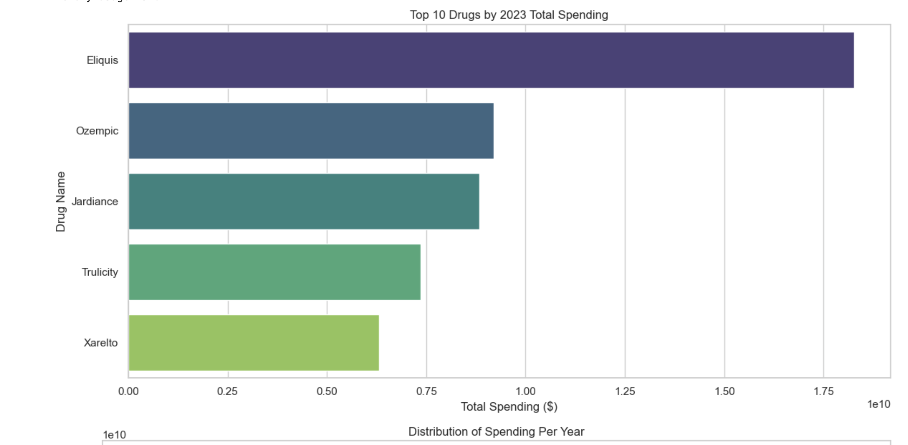
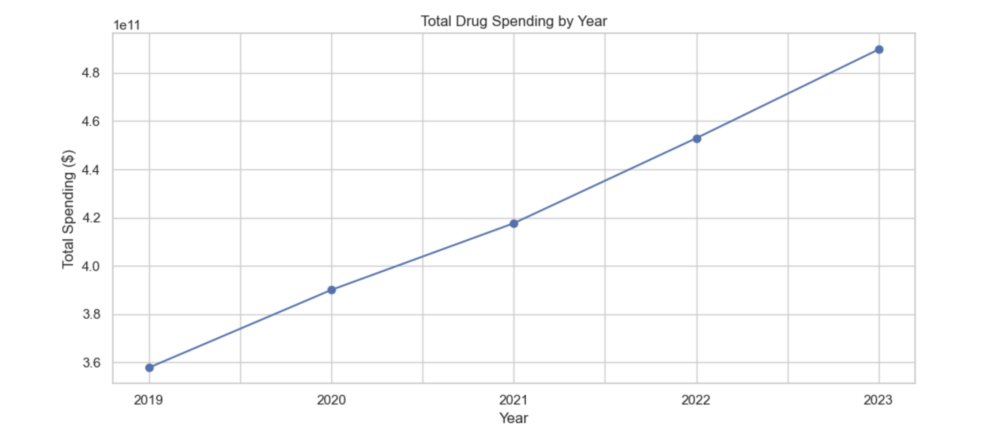
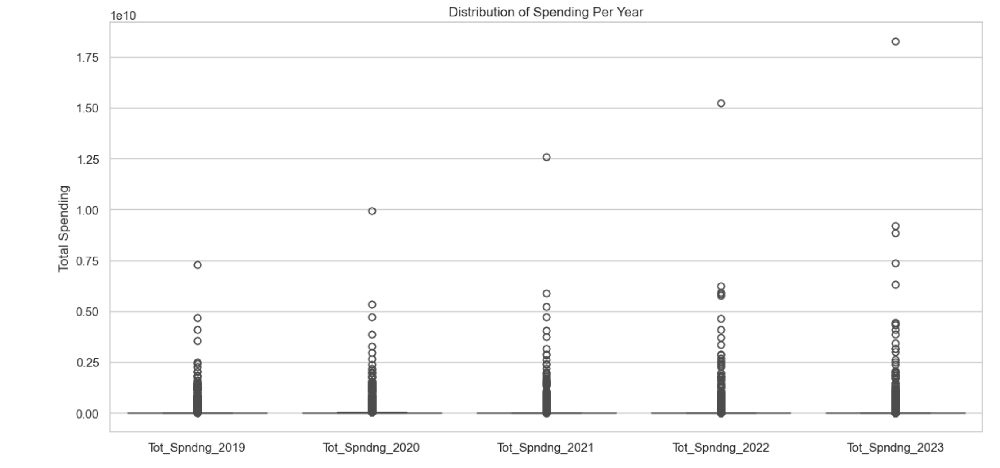
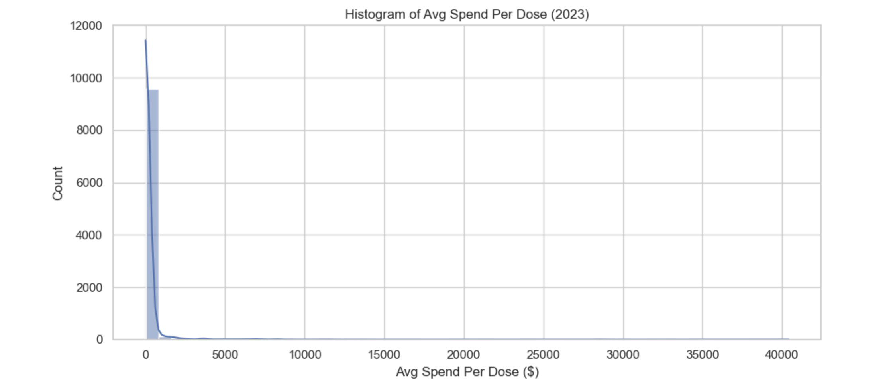
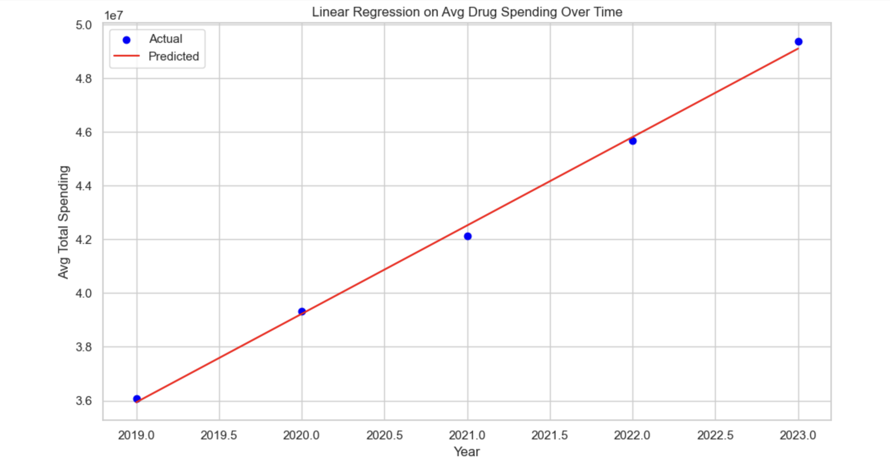

 # TheCostOfCareAnalytics – U.S. Prescription Drug Spending Analysis

**Author:** Darious Brown  
**GitHub:** https://github.com/Dare215  
**LinkedIn:** https://www.linkedin.com/in/dariousbrown  
**Portfolio:** https://dare215.github.io/DariousBrown-Portfolio/  
**Email:** dariousbrown3@icloud.com

---

# Project Overview

TheCostOfCareAnalytics is a healthcare analytics project focused on examining prescription drug spending trends across the United States. Using exploratory data analysis (EDA), statistical modeling, and predictive analytics, this project investigates how pharmaceutical expenditures have evolved over time and identifies the medications driving the largest healthcare costs.

The analysis explores spending distributions, cost trends, average spending per dose, and spending forecasts using regression modeling. The project demonstrates how data science can support healthcare decision-making, cost optimization, and policy evaluation.

---

# Business Problem

Prescription drug costs continue to rise and place significant financial pressure on healthcare systems, insurance providers, employers, and patients.

Key questions addressed include:

- Which medications account for the highest healthcare spending?
- How has total drug spending changed over time?
- What spending trends are emerging?
- How concentrated are prescription drug expenditures?
- Can future spending patterns be estimated using predictive analytics?

---

# Dataset

The dataset contains prescription drug spending metrics from 2019 through 2023.

Variables analyzed include:

- Drug Name
- Total Spending
- Spending by Year
- Average Spend per Dose
- Annual Cost Trends
- Utilization Metrics

---

# Technologies Used

- Python
- Pandas
- NumPy
- Matplotlib
- Seaborn
- Scikit-Learn
- Jupyter Notebook

---

# Visualizations

## Top Drugs Driving Healthcare Costs

This visualization highlights the medications responsible for the largest total spending in 2023.

Key Findings:

- Eliquis generated the highest total spending.
- Ozempic and Jardiance ranked among the fastest-growing expenditures.
- Spending concentration is heavily driven by a small number of medications.

---

## Total Drug Spending Trend

Key Findings:

- Drug spending increased every year from 2019 through 2023.
- Spending growth accelerated after 2021.
- Overall spending reached its highest level in 2023.

---

## Spending Distribution Analysis

Key Findings:

- Spending distributions are highly skewed.
- Most medications account for relatively small spending amounts.
- A small number of drugs contribute disproportionately large expenditures.

---

## Average Spending Per Dose

Key Findings:

- Most medications have relatively low average cost per dose.
- Several extreme outliers exist with significantly higher treatment costs.
- Cost variability suggests opportunities for further pricing analysis.

---

## Drug Spending Forecast Model

Key Findings:

- Linear regression indicates a strong upward spending trend.
- Forecasts suggest continued increases in pharmaceutical expenditures.
- Historical spending patterns demonstrate sustained year-over-year growth.

---

# Statistical Analysis

The project applies:

- Descriptive Statistics
- Exploratory Data Analysis (EDA)
- Distribution Analysis
- Trend Analysis
- Linear Regression Modeling
- Forecasting Techniques

---

# Results Summary

Major findings include:

- Prescription drug spending increased consistently from 2019–2023.
- Spending is concentrated among a small number of high-cost medications.
- Several diabetes and cardiovascular drugs dominate expenditure rankings.
- Average spending per dose varies significantly across treatments.
- Regression modeling indicates continued growth in pharmaceutical costs.

---

# Healthcare Impact

This analysis can support:

- Pharmaceutical Cost Management
- Healthcare Policy Development
- Insurance Pricing Strategies
- Budget Forecasting
- Value-Based Care Initiatives
- Drug Utilization Reviews

---

# Future Enhancements

Future versions may include:

- Machine Learning Forecasting Models
- Drug Class Comparisons
- Medicare vs Commercial Spending Analysis
- Inflation-Adjusted Cost Modeling
- Geographic Spending Analysis
- Interactive Streamlit Dashboard

---

# Repository Structure

TheCostOfCareAnalytics/
│
├── data/
│ └── Drug Spending Dataset
│
├── notebook/
│ └── TheCostOfCareAnalytics.ipynb
│
├── visuals/
│ ├── TheCostOfCareAnalyticsAI.png
│ ├── TotalDrugSpendingTrend.png
│ ├── DistributionOfDrugSpendingPerYear.png
│ ├── AverageSpendPerDose2023.png
│ └── DrugSpendingForecastRegression.png
│
├── requirements.txt
│
└── README.md

---

# License

MIT License

---

# Author

Darious Brown

Artificial Intelligence & Machine Learning Engineer

Healthcare Analytics | Data Science | Predictive Modeling | Business Intelligence
